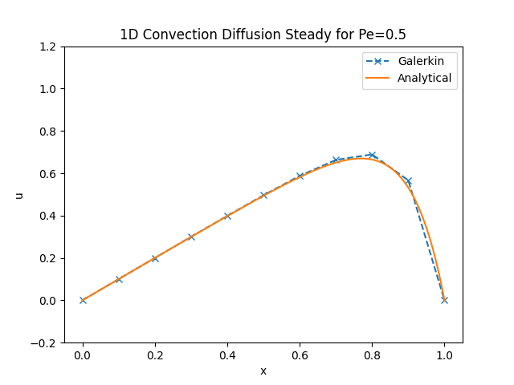
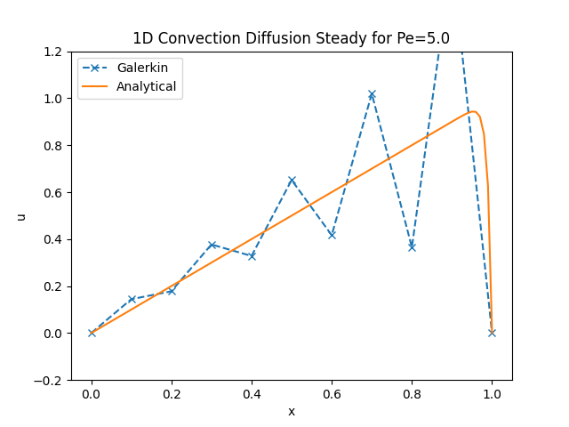
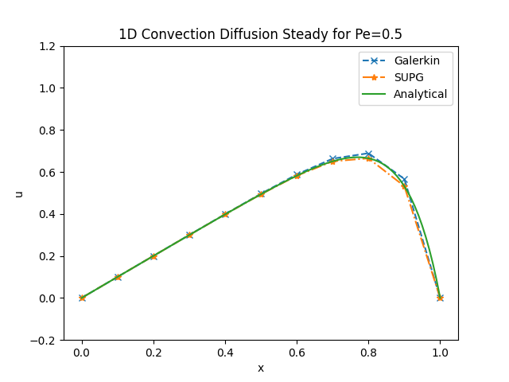
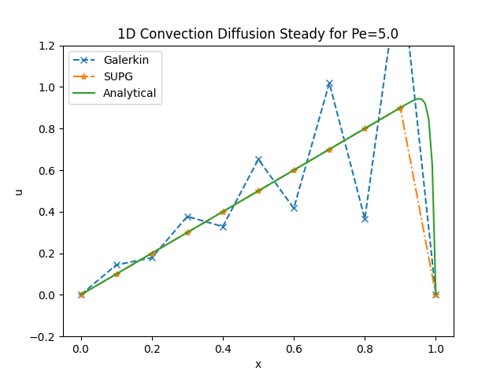

# 1D Finite Element Method (FEM) Solver - 1D Steady Convection Diffusion Equation with unity source term and Dirichlet BCs

##
This code employs a one dimensional Finite Element Method (FEM) solver in Python. It uses the Galerkin method with 1D Lagrange basis functions and 2nd order Gaussian Quadrature for numerical integration. The purpose of this exercise is to show how with increasing Peclet numbers, a stabilization of the standard Galerkin method is required. In this case, we employ the SUPG stabilization. 

## Features
- **Solver Methods**: 
- **Basis Functions**: Uses 1D Lagrange basis functions for spatial discretization.
- **Gaussian Quadrature**: Employs 2nd Order Gaussian Quadrature for numerical integration.
- **User Interaction**: Allows user input for convection speed (constant value assumed) and kinematic viscosity.

## Requirements
- Python 3.x
- NumPy
- Matplotlib
- os
- Scipy

## Usage
To run the solver, execute 'main.py' script in a Python environment and follow the terminal prompts. See below for sample usage.

```
python main.py
```

You will then see the following: 

```
Welcome to the steady 1D convection diffusion problem. We will be solving this problem with the standard galerking method and SUPG to illustrate its differences

>>> Please enter a convection speed (Press 'Enter' for default value) -----> 1
>>> Please enter a value for kinematic viscosity (Press 'Enter' for default value) -----> .01

```

## Output
The program computes and plots the numerical solution of the 1D Steady Convection Diffusion  given a unity source term and Dirichlet Boundary Conditions.

# Background
## Strong Form
The strong form of the steady 1D convection-diffusion problem is given by:

$$
\alpha \frac{\partial u}{\partial x} - \nu \frac{\partial^2 u}{\partial x^2} = s(x)
$$

Where $\alpha$ is the convection speed, $\nu$ is the diffusion coefficient and the source term is given by $s(x) = 1$. 

The boundary conditions are given by:

$$
u(0) = 1
$$

$$
u(1) = 0
$$

## Weak Form - Standard Galerkin
To move to a weaker form of the formulation, and the basis of FEM, we apply the Galerkin method. This involves approximating variables by weight and trial functions.

By weakening the form and integrating over the domain we get:

$$
\int_{\Omega} w\alpha u_x\, dx - \int_{\Omega} w \nu u_{xx}\, dx = \int_{\Omega} s w\,dx
$$

NOTE: The trial function $u$ satisfies the Dirichlet BC's set (i.e $u(1) = g$) and the weight function $w$ satisfies the homogeneous version of the BC (i.e $w(1) = 0) satisfied by the trial function

The next part in achieving the weak form is to reduce the second order derivative $\nu \frac{\partial^2 u}{\partial x^2}$ by integrating by parts:

$$
\int_{\Omega} w\alpha u_x\, dx - \left[ \cancel{\left[ \nu u_xw\right]^1_0 }^{=0} - \int_{\Omega} \nu u_x w\, dx \right] = \int_{\Omega} s w\,dx
$$

$$
\int_{\Omega} w\alpha u_x\, dx + \int_{\Omega}\nu u_x w_x \,dx = \int_{\Omega} s w\,dx \tag{1}
$$

Now that we have the galerkin weak form, we want to discretize our problem to be able to solve it numerically by code. In this example it will be discretized using a uniform mesh of Linear elements of size $h$.

- We define the number of nodes:

$$
n = 1,2,3,..., n_{eq}, n_{eq+1}, n_{ne}
$$

- Viewing $\Omega$ as discretized:

$$
u^h (x) =  \sum_{A \epsilon | nD} N_B (x) u_A +  \sum_{A \epsilon nD} N_B(x) u_D(x_A) \tag{2}
$$

$$
w^h = span \{ N_A \} \tag{3}
$$

- Substituting $(2)$ and $(3)$ into $(1)$ for internal nodes:

$$
\int_{\Omega} \sum_{B=2}^{n_{eq+1}} N_A \alpha \frac{\partial N_B}{\partial x}u_B  \, dx + \int_{\Omega} \sum_{B=2}^{n_{eq+1}} \nu \frac{\partial N_B}{\partial x} u_B \frac{\partial N_A}{\partial x} \, dx  = \int_{\Omega} N_A s\,dx
$$

$$
\int_{\Omega} \sum_{B=2}^{n_{eq+1}} \left( N_A \alpha \frac{\partial N_B}{\partial x} +  \nu \frac{\partial N_B}{\partial x} \frac{\partial N_A}{\partial x} \, dx \right) u_B \, dx = \int_{\Omega} N_A s\,dx \tag{4}
$$

- From equation $(4)$ we can get to our system of equations that we need to solve:

$$
K u_B = F
$$

- Where $K$ is our global stiffness matrix and $F$ our force vector given by:

$$
K = \int_{\Omega} \sum_{B=2}^{n_{eq+1}} \left( N_A \alpha \frac{\partial N_B}{\partial x} +  \nu \frac{\partial N_B}{\partial x} \frac{\partial N_A}{\partial x} \, dx \right)
$$

$$
F = \int_{\Omega} N_A s\,dx
$$

- In the Finite Element Method, the global stiffness matrix $K$ and force vector $F$ are assembled from local element matrices. The local element matrices are computed using Gaussian quadrature to accurately integrate over each element:

    - For each element, the local stiffness matrix $K^e$ and force vector $F^e$ are computed using the shape functions and their derivatives. This involves evaluating integrals of the form $\int_{\Omega e} N_A \alpha \frac{\partial N_B}{\partial x}$, $\int_{\Omega e} \nu \frac{\partial N_A}{\partial x} \frac{\partial N_B}{\partial x}$ and $\int_{\Omega e} N_A s$.

    - The integrals are evaluated using Gaussian quadrature, which approximates the integral of a function as a weighted sum of the function's values at specific points (Gauss points) within the integration domain. For a 2nd-order Gaussian quadrature, two Gauss points are used with their corresponding weights.

    - The Gauss points $(\xi_i)$ and weights $(w_i)$ for 2nd-order Gaussian quadrature are:
    
    $$
    \xi_1 = - \frac{1}{\sqrt 3}
    $$

    $$
    \xi_2 = \frac{1}{\sqrt 3}
    $$

    $$
    w_1 = w_2 = 1
    $$

    - These points and weights are used to evaluate the integrals over each element. The integration points and weights in the physical domain are optained by mapping the Gauss points from the reference domain $[-1, 1]$ to the element domain $[x_i, x{i+1}]$

    - The assembled global matrices $K$ and $F$ are formed by summing the contributions from all elements.

- In 1D, a linear element is defined by two nodes denoted usually by 1,2. There equivalent shape functions are given by:

$$
N_1(\xi) = \frac{1}{2}(1-\xi) \tag{5}
$$

$$
N_2(\xi) = \frac{1}{2}(1+\xi) \tag{6}
$$

- With $\xi$:

$$
-1 \leq \xi \leq +1
$$

- Where at any interior point of the element:

$$
u(\xi) = N_1(\xi)u_1 + N_2(\xi)u_2
$$

$$
x(\xi) = N_1(\xi)x_1 + N_2(\xi)x_2
$$

- For a uniform mesh of size $h$:

$$
dx = \frac{1}{2}(x_2 - x_1)d\xi = \frac{h}{2}d\xi \tag{7}
$$

- Therefore for the derivative transforamtion we can substitute $(7)$ into $\frac{\partial N_B}{\partial x}$:

$$
\frac{\partial N_B}{\partial x}=\frac{\partial N_B}{\frac{h}{2} \partial \xi}
$$

$$
\frac{\partial N_B}{\partial x}= \frac{2}{h} \frac{\partial N_B}{\partial \xi}
$$

- Looking at $(4)$, our equation to solve, and applying our tranformations described in the previous 2 bullet points it gives us for the first term to the left (Convection):

$$
1^{st}\,term = \alpha \int_{\Omega^e} \left[ \begin{array}{cc}
\cancel{\frac{2}{h}} N_1  \frac{\partial N_1}{\partial \xi} & \cancel{\frac{2}{h}} N_1  \frac{\partial N_2}{\partial \xi}  \\
\cancel{\frac{2}{h}} N_2  \frac{\partial N_1}{\partial \xi}  & \cancel{\frac{2}{h}} N_2  \frac{\partial N_2}{\partial \xi}  \\
\end{array} \right] \, \cancel{\frac{h}{2}}\, d\xi = \alpha \int_{\Omega^e} \left[ \begin{array}{cc}
N_1  \frac{\partial N_1}{\partial \xi} &  N_1  \frac{\partial N_2}{\partial \xi}  \\
N_2  \frac{\partial N_1}{\partial \xi}  & N_2  \frac{\partial N_2}{\partial \xi}  \\
\end{array} \right] \,d\xi 
$$

- Similarly for the second term to the left (Diffusion):

$$
2^{nd}\,term = \nu \int_{\Omega^e} \left[ \begin{array}{cc}
\left(\frac{2}{h}\right)^2 \frac{\partial N_1}{\partial \xi} \frac{\partial N_1}{\partial \xi} & \left(\frac{2}{h}\right)^2 \frac{\partial N_1}{\partial \xi} \frac{\partial N_2}{\partial \xi} \\
\left(\frac{2}{h}\right)^2 \frac{\partial N_2}{\partial \xi} \frac{\partial N_1}{\partial \xi}  & \left(\frac{2}{h}\right)^2 \frac{\partial N_2}{\partial \xi} \frac{\partial N_2}{\partial \xi} 
\end{array}\right] \, \frac{h}{2}\, d\xi
$$

- Therefore the local Stifness matrix is given by:

$$
K^e = \alpha \int_{\Omega^e} \left[ \begin{array}{cc}
N_1  \frac{\partial N_1}{\partial \xi} &  N_1  \frac{\partial N_2}{\partial \xi}  \\
N_2  \frac{\partial N_1}{\partial \xi}  & N_2  \frac{\partial N_2}{\partial \xi}  \\
\end{array} \right] \,d\xi + \nu \int_{\Omega^e} \left[ \begin{array}{cc}
\left(\frac{2}{h}\right)^2 \frac{\partial N_1}{\partial \xi} \frac{\partial N_1}{\partial \xi} & \left(\frac{2}{h}\right)^2 \frac{\partial N_1}{\partial \xi} \frac{\partial N_2}{\partial \xi} \\
\left(\frac{2}{h}\right)^2 \frac{\partial N_2}{\partial \xi} \frac{\partial N_1}{\partial \xi}  & \left(\frac{2}{h}\right)^2 \frac{\partial N_2}{\partial \xi} \frac{\partial N_2}{\partial \xi} 
\end{array}\right] \, \frac{h}{2}\, d\xi
$$

- For the source term (right side term) at any interior point of the element:

$$
s(\xi) = N_1(\xi) s_1 + N_2(\xi)s_2
$$

- Therefore the local Force vector is given by:

$$
F^e = \int_{\Omega^e} \left[\begin{array}{cc}
N_1(N_1 s_1 + N_2 s_2)\\ N_2(N_1 s_1 + N_2 s_2)
\end{array}\right]\, \frac{h}{2}\, d\xi
$$

- Assembling all of this as discussed we get the classical Galerkin solution solved using 10 linear elements for the 1D convection diffusion using linear elements for Peclet Number 0.5 and 5 (dimensionless number that measures the relative importance of convection to diffusion):

<div style="display: flex; justify-content: center;">
    <div style="margin: 0 10px;">
        
        <p style="text-align: center;">Pe = 0.5 Standard Galerkin and SUPG applied</p>
    </div>
    <div style="margin: 0 10px;">
        
        <p style="text-align: center;">Pe = 5.0 Standard Galerkin and SUPG applied</p>
    </div>
</div>

- As you can see from the graphs above, when a high peclet number is seen, the standard Galerkin results in oscillations that need to be dampened using some form of stabilization, discussed further on.

## Stabilization - SUPG Method
In order to stabilize the result of high peclet numbers (high convection to diffusion) we need to add some numerical stabilization. This can be done in the form of Streamline-Upwind Petrov-Galerkin (SUPG) stabilization that can be added to the Galerkin formulation. SUPG introduces an additional term that aligns with the flow direction, thereby reducing oscillations and enhancing solution stability. The steps in stabilizing the solution are as follows:

- We take the residual of the differential equation as:

$$
R(u) = \alpha \cdot \nabla u - \nabla \cdot(\nu \nabla u) - s = 0
$$

- Where $R(u)$ is only computed for each element interior of $\Omega^e$

- At the element the stabilization term added to our equation to be solved is defined as:

$$
\sum_e \int_{\Omega^e} P(w) \tau R(u) d\Omega
$$

- Where $P(w)$ is the pertubation of the test function taken as: 

$$
P(w)= \alpha \cdot \nabla w
$$

- \tau is the stabilization parameter (also called intrisnic time). In 1D this is defined as:

$$
\tau = \frac{\frac{\beta \alpha h}{2}}{||\alpha||^2}
$$

- Where $\beta$ is given by:

$$
\beta = coth(Pe) - \frac{1}{Pe}
$$

- And the Peclet number as it has not been previously defined is given by:

$$
Pe = \frac{a h}{2\nu}
$$

- Adding this to our formulation in $(4)$ we get: 

$$
\int_{\Omega} \sum_{B=2}^{n_{eq+1}} \left( N_A \alpha \frac{\partial N_B}{\partial x} +  \nu \frac{\partial N_B}{\partial x} \frac{\partial N_A}{\partial x} + \frac{\partial N_A}{\partial x} \alpha^2 \tau \frac{\partial N_B}{\partial x} \, dx \right) u_B \, dx = \int_{\Omega} \left(\alpha \frac{\partial N_A}{\partial x} \tau  + N_A \right) s\,dx  
$$

- Following the same steps as before with the adjusted formulation we can build the matrices and achieve the following results:

<div style="display: flex; justify-content: center;">
    <div style="margin: 0 10px;">
        
        <p style="text-align: center;">Pe = 0.5 Standard Galerkin</p>
    </div>
    <div style="margin: 0 10px;">
        
        <p style="text-align: center;">Pe = 5.0 Standard Galerkin</p>
    </div>
</div>

- As you can see, now for higher peclet number, the solution has been stabilized.